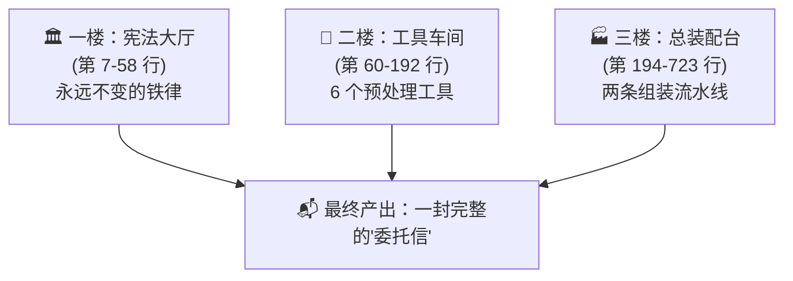
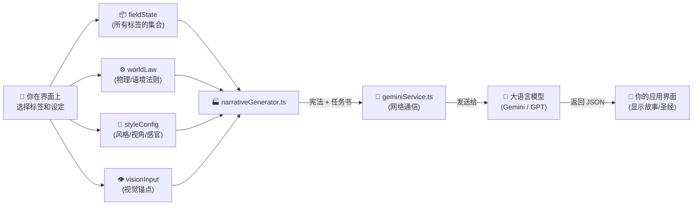

# 📖 `narrativeGenerator.ts` 完整非技术解读

> **用一句话概括这个文件：** 它是一座**文字工厂**，把你在界面上选择的所有词条和设定，组装成一封极其详细的"委托信"，然后这封信被发送给 AI，AI 读完后按照信中的要求写出故事。

---

## 🏗️ 整体结构：一座工厂的三个楼层



---

## 一楼：宪法大厅（第 7-58 行）

### 进口原料仓库（第 7-36 行）

这部分就像是工厂门口堆放的各种"原料箱"。代码把以下东西搬进了工厂：

| 原料 | 来源 | 干什么用 |
|------|------|----------|
| 你选的所有标签（M0-M7, SUR1-SUR11 等） | `types.ts` 中的定义 | 知道你选了什么 |
| M 系核心引擎的所有词条定义 | `data/engine_core/` | 查找你选的标签的具体含义 |
| 表层词库（类型、时代、场景等） | `data/skin_libraries` | 查找你选的表层设定的含义 |
| 体量 (SV2) 和叙事动力 (SUR1) 数据 | `data/engine_sv/`, `data/engine_surface/` | 确定片长策略和类型驱动 |
| 文学风格矩阵和导演风格库 | `data/style_matrix`, `data/director_styles` | 确定写作风格 |
| 8 大铁律协议 | `data/engine_core/narrative_protocols.ts` | 宪法内容本身 |
| 词条查找工具 | `services/dataRegistry` | 根据词条名字查出详细定义 |

**对生成的影响：** 这部分本身不产生任何文字，它只是让工厂有原料可用。如果某个原料没有被搬进来，后面就无法使用它。

---

### 📜 系统宪法 (NARRATIVE_SYSTEM_BIBLE)（第 38-58 行）

这是整个引擎最核心的"不变量"。它把 8 大协议拼接成一段超长的文字，**每次生成时，这段文字永远作为 AI 看到的第一段内容**。

它包含了以下 8 部宪法：

| 协议名称 | 核心功能 | 对生成的影响 |
|----------|----------|-------------|
| **命名协议** | 规定角色/地点的命名规则 | AI 不会起"小明""Tom"这种无聊名字；严禁单字名；默认国际化 |
| **文学美学协议** | 规定写作的美学标准 | 强制 AI 写光影描写、材质对比、隐喻实体化，禁止干巴巴的叙述 |
| **引擎核心公式** | 教 AI 理解 M0-M7 和 SUR1-SUR11 分别"代表什么" | AI 不会把"义体"理解为"装假肢"，而是理解为"主体是他人意志的延伸" |
| **创作铁律** | 10 条绝不可违反的规则 | 禁止暴露引擎术语、强制否定之否定的辩证法、强制美学距离 |
| **代数协议** | 教 AI 理解公式的数学关系 | AI 知道 M4 是"除数"（阻力），M5 是"乘数"（动力），知道拓扑权重影响结构重心 |
| **兜底拓扑模板** | 当没有选类型时的默认指令 | 即使你啥类型都没选，AI 也知道怎么动态构建叙事骨架 |
| **风格逻辑协议** | 教 AI 怎么正确"模仿"一个作者 | AI 不会堆砌王家卫的"凤梨罐头"，而是模仿他的"时间病态敏感 + 物哀投射"底层逻辑 |
| **面具协议** | 教 AI 如何隐藏哲学深度 | 故事表面是合格的商业类型片（让观众爽），但深层有结构性悲凉（让评论家思考） |

**对生成的影响：** 这是 AI 的**世界观操作系统**。无论你后面选了什么标签、什么风格，AI 的思维方式都被这 8 部宪法深层锁定。它是所有创作的底层逻辑基石。

> [!IMPORTANT]
> 这段文字对每次生成都完全一样（静态的），这让 AI 的API可以缓存它（KV Cache），从而加快生成速度、降低费用。

---

## 二楼：工具车间（第 60-192 行）

这里有 6 个"预处理工具"，它们在发送给 AI 之前，先把你选的原始标签"加工"成 AI 更容易理解的格式：

### 🔧 工具 1：`buildContext`（第 60-78 行）— 标签翻译机

**做什么：** 把你选的所有标签（比如 `engine_m1: ["螺丝钉(The Cog)"]`）翻译成一段结构化的文字清单。

**输入：** 你在界面上选的所有标签
**输出示例：**
```
* **Subject of Lack (engine_m1)**: 螺丝钉(The Cog)
      ([螺丝钉(The Cog)]: 系统中无足轻重、可被替代、丧失个性的功能性部件...)
```

**对生成的影响：** AI 通过这个清单一眼就能看到你选了什么词条 + 每个词条的完整定义。这是 AI 理解"你到底想要什么故事"的核心数据源。

---

### 🔧 工具 2：`buildFormalLawEngine`（第 80-128 行）— ⚖️ 形式律法引擎 [刚刚新建的！]

**做什么：** 生成一段伪代码风格的"形式约束"区块。只管形式（字数、结构、语言风格），不管内容。

**输入：** 目标类型（PITCH 或 BIBLE）、目标字数、风格名、叙事结构标签
**输出示例：**
```
## ⚖️ FORMAL LAW ENGINE (形式律法 — 不可违反)
[ENFORCE_MODE: STRICT]

[LAW_1] WORD_COUNT:
    每个故事概念 (Pitch) ≈ 500-700 字...

[LAW_2] DRAMATIC_STRUCTURE:
    REQUIRE: [ INCITING_INCIDENT → RISING_ACTION → CLIMAX → RESOLUTION ]
    DENY:   [ Deus_ex_machina, 无冲突流水账... ]
...
```

**对生成的影响：** 这是"物理定律"——AI 的内容可以天马行空，但字数必须达标、结构必须完整、语言必须有电影感、学术黑话必须被转译。就像画家可以画任何题材，但画布尺寸和颜料种类是固定的。

---

### 🔧 工具 3：`getBannedWords`（第 130-147 行）— 黑名单生成器

**做什么：** 收集所有你选中的标签名字（比如"螺丝钉"、"义体"），再加上一堆固定的哲学术语（"大他者"、"异化"、"阉割"等），拼成一个禁用词黑名单。

**对生成的影响：** AI 在写故事时不能直接使用这些词。这迫使 AI 必须把"螺丝钉"转译成"在流水线上每天按 4000 次红色按钮的人"，而不是偷懒写"他觉得自己像个螺丝钉"。

---

### 🔧 工具 4：`getNarrativeTopology`（第 149-192 行）— 类型拓扑引擎

**做什么：** 根据你选择的**类型标签**（比如"武侠"、"黑色电影"、"科幻"），去词库里找到该类型的专属"拓扑指令"（即：这种类型的故事应该把重心放在公式的哪个位置）。

**对生成的影响：**
- 如果你选了**动作/武侠** → AI 会把 M5（动作驱力）的权重调到最高，减少内心独白
- 如果你选了**惊悚/恐怖** → AI 会把 M4（大他者/威胁）的权重调到最高，营造窒息感
- 如果你选了**爱情/剧情** → AI 会把 M1（主体）和 M3（欲望）的权重调到最高，聚焦关系张力
- 如果你**啥都没选** → 使用宪法里的兜底模板，让 AI 自行推断

---

## 三楼：总装配台（第 194-723 行）

这是两条主要的组装流水线，分别生产两种不同的产品：

---

### 🏭 流水线 A：生成三个分歧点故事 — `buildNarrativePrompt`（第 194-463 行）

**这是你点击"生成"按钮后运行的第一个大函数。**

它接收 5 个输入：
- `duration`：时长
- `fieldState`：你选的所有标签
- `visionInput`：你输入的视觉文字描述（如果有）
- `visionImage`：你上传的参考图（如果有）
- `worldLaw`：世界法则（物理法则 + 语境法则）

然后它按照以下工序依次"组装"委托信：

#### 工序 1：调用预处理工具（第 202-204 行）
调用上面的"翻译机"、"黑名单生成器"、"拓扑引擎"，准备好基础原料。

#### 工序 2：提取世界逻辑标签（第 206-213 行）
把你选的类型（SUR1）、时代（SUR2）、动画类型整合成一行：
```
黑色电影 (场域: 近未来 / 赛博朋克)
```
这个"世界逻辑"文字会被反复引用在 AI 的指令中。

#### 工序 3：M0 精神结构协议（第 215-240 行）
如果你选了 M0（精神底色，比如"强迫症""歇斯底里"），这里会生成一段**最高优先级**的特殊指令，告诉 AI：
- 如果是强迫症 → 故事的核心逻辑是"控制"和"拖延"
- 如果是自闭症 → 故事的核心逻辑是"封闭"和"防御入侵"
- 如果是偏执症 → "一切都是征兆，他者是恶意的"

**对生成的影响：** M0 是整个公式中**权重最高**的参数。一旦选了它，整个宇宙的因果律都会被它重塑。

#### 工序 4：体量与结构协议（第 242-274 行）
根据你选的片长（15秒？1分钟？5分钟？），生成不同的策略：
- **微型（<60秒）：** AI 被告知叙事结构标签（如"循环""倒叙"）应该被当作**剪辑手法**，不是情节设备
- **短片（1-3分钟）：** AI 被告知写一个紧凑的单冲突弧线
- **长篇（>3分钟）：** AI 被告知可以展开完整的人物弧光和世界构建

#### 工序 5：世界法则注入（第 276-305 行）
根据你的物理法则和语境法则设定，生成两段硬约束：
- **物理法则 = STRICT → "严禁魔法、鬼魂、超光速"**
- **物理法则 = UNBOUND → "隐喻可以实体化，梦境逻辑允许"**
- **语境法则 = PURE → "武侠就是纯武侠，不混搭"**
- **语境法则 = FUSION → "鼓励混搭碰撞"**

#### 工序 6：时空锚点推演（第 307-360 行）
这是一个"智能兜底"系统：
- **如果你选了精确年份/国家** → AI 被强制锁定在那个时空（如"1942年的上海"）
- **如果你啥都没选 + 物理法则 = STRICT** → AI 自行推演最合理的国际化设定（如"黑色电影"→ 默认洛杉矶或香港）
- **如果你啥都没选 + 物理法则 = UNBOUND** → AI 可以自由创造一个最适合戏剧张力的世界

#### 工序 7：🔨 最终组装 — `dynamicTaskPrompt`（第 362-460 行）
**这是整个流水线的高潮。** 前面准备的所有原料在这里被拼装成一份完整的"任务书"。

这份任务书的骨架是：
```
# 本次任务执行区
  ## 📍 时空坐标与视觉锚点
  # 🔗 动态结构转译指令 (M1/M4/M3 如何具象化)
  ## ⚖️ 形式律法 (字数/结构/文风约束)
  ## 🚫 动态禁用词表
  ## 1. 动态 DNA 序列 (拓扑 + M0 + 体量 + 全标签定义)
  ## 2. 局部世界法则与美学约束
  ## 3. 叙事质量控制 (别像数据库，要像作家)
  ## 4. 三重叙事镜头 (STRUCTURALIST / POST_STRUCTURALIST / THE_REAL)
  ## 5. 输出格式 (严格 JSON)
```

**三重分歧点的定义就在"## 4"：**
- **OPTION 1 结构主义：** 经典类型片。外部冲突为主。好莱坞式。
- **OPTION 2 后结构主义：** 人物研究。内在冲突为主。王家卫/A24 式。
- **OPTION 3 实在界：** 氛围主导。环境压倒个体。塔可夫斯基式。

#### 工序 8：出厂（第 462 行）
```
return { text: NARRATIVE_SYSTEM_BIBLE + '\n\n' + dynamicTaskPrompt, images: ... };
```
把**宪法**（不变的底层规则）+ **任务书**（动态的具体指令）缝在一起，这就是发送给 AI 的最终完整文本。

---

### 🏭 流水线 B：生成创世圣经 — `buildNarrativeBiblePrompt`（第 465-723 行）

**这是你选中了某个分歧点故事后，点击"生成创世圣经"时运行的函数。**

它接收 5 个输入：
- `treatment`：你选中的那个故事概念（标题、基调、Pitch 文本）
- `styleConfig`：你选的文学风格/导演风格/视角/感官偏好
- `fieldState`：你选的所有标签（同上）
- `visionInput`：视觉锚点文字（同上）
- `worldLaw`：世界法则（同上）

#### 工序 1-3：体量策略（第 472-506 行）
根据片长决定"写成什么文体"以及"写多少字"：

| 片长 | 文体 | 目标字数 |
|------|------|----------|
| 15秒/30秒 | 闪小说 / 电影散文诗 | 250 字 |
| 60秒/90秒/3分钟 | 紧凑短篇 | 500-800 字 |
| 5分钟/15分钟 | 丰富短篇 | 1500-3000 字 |
| 更长 | 中篇章节 | 8000 字 |

#### 工序 4-6：重复的智能提取（第 508-612 行）
和流水线A类似——提取 M0 协议、世界法则、时空锚点、视觉锚点等。（这部分逻辑和前面的流水线A大量重复，未来可以考虑合并。）

#### 工序 7：文学风格匹配（第 614-632 行）
根据你选择的风格配置，去风格库里查找：
- 选了某个导演风格（如"王家卫"）→ 提取其核心特征和定义
- 选了某个文学风格（如"极简主义"）→ 提取其 DNA 和经典案例
- 选了某种视角（如"第一人称"）→ 注入视角指令
- 选了某种感官偏好（如"触觉优先"）→ 注入感官指令

**对生成的影响：** AI 的写作"声音"会完全变化。同一个故事，选了"塔可夫斯基"写出来是缓慢沉思的长镜头文学，选了"盖·里奇"写出来是快节奏多线叙事。

#### 工序 8：🔨 最终组装 — `dynamicTaskPrompt`（第 634-720 行）
圣经的任务书骨架是：

```
# 本次任务执行区
  # 1. Role: 文学大师 & 影子写手
  # Task: 写一篇 [紧凑短篇 / 闪小说 / ...]
  ## 关键指令: 目标长度 X 字
  ## 命名协议

  # 2. 动态约束与法则
    (体量策略 + 世界法则 + 锚点推演 + 时空坐标)
    ⚖️ 形式律法引擎 (字数/结构/文风/卫生)

  ## 🧬 视觉资产美学标准 (人物要美型、场景要电影感)
  ## 🚫 词汇黑名单

  # 3. 原始素材 (你选中的那个分歧点故事的标题/基调/Pitch)
    + 视觉锚点 + 拓扑指令 + M0 + 全标签定义

  # 4. 风格执行 (你选的导演/作家风格 + 视角 + 感官偏好)

  # 5. 输出格式 (严格 JSON)
    {
      narrative: { title, logline, synopsis (正文!) },
      context: { world, tone, colorPalette, moodboard },
      assets: { characters[], locations[], props[] }
    }
```

**和分歧点的关键区别：**
- 分歧点要求 AI 输出 3 个简短概念（每个 ~600 字）
- 创世圣经要求 AI 输出 1 部完整的文学作品（250-8000 字），外加世界观设定、配色方案、角色/场景/道具资产清单（含中英文 AI 绘图提示词）

#### 工序 9：出厂（第 722 行）
```
return NARRATIVE_SYSTEM_BIBLE + '\n\n' + dynamicTaskPrompt;
```
同样是**宪法 + 任务书**缝合后输出。

---

## 🔄 完整数据流一览



---

## ❓ 常见问题

**Q: 我在界面上改了标签，是不是只影响"动态任务书"那部分？**
> 是的。宪法（System Bible）永远不变。你的标签选择只会改变任务书中的具体参数值。

**Q: 如果我不选某个参数（比如不选 M0），会怎样？**
> 对应的代码会检测到你没选，然后那段指令直接不生成，AI 就不会收到那部分约束。比如不选 M0，就不会有精神结构协议——AI 会按默认的"普通人"逻辑写故事。

**Q: 为什么有些指令用英文写，有些用中文？**
> 宪法里的协议大多是中英混合的——因为大语言模型对英文指令格式的遵循度更高（如 `REQUIRE`, `DENY`, `IF...THEN`），但对中文内容理解也很好。这是一种工程上的"最优混合"策略。
