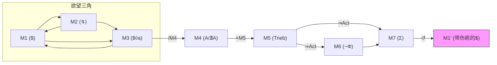

# 迷雾学派叙事生成引擎 正交性分析报告

## 第四部分（终篇）：引擎回路完整性检测与综合评分

---

## 1. M0 全局编译器兼容性检测

### 1.1 M0 四协议栈对下游模块的引力扭曲

M0 定义了四种全局协议（Neurosis / Perversion / Psychosis / Autism），每种协议通过三个"力学常数"对 M1-M7 的运行施加全局性修正：

| 力学常数 | 影响的下游模块 | 效果说明 |
|:---|:---|:---|
| **M4 传导 (Law/Gravity)** | M4 | 决定大他者阻断以何种方式作用于主体 |
| **M1→M5 转化率** | M1, M5 | 决定缺失的欲望有多少转化为驱力输出 |
| **M2 创伤吸收** | M2 | 决定遭遇事件如何被主体的象征系统处理 |

### 1.2 四协议栈 × M4 传导模式对照

| 协议 | M4传导模式 | 描述 | 兼容性判定 |
|:---|:---|:---|:---|
| **神经症** | 内化阻尼 | M4 转化为内部摩擦力 | ✅ 与 M4 全五组兼容 |
| **性倒错** | 杠杆效应 | M4 被视为外部工具，主体寻租 | ✅ 但 M4-E（缺席）组产生悖论——无杠杆可用 |
| **精神病** | 直通穿透 | 规则如背景噪音，无约束力 | ⚠️ M4 实质失效——需检查公式中"/M4"的分母是否趋零 |
| **孤独症** | 完全绝缘 | 外部法律无法穿透外壳 | ⚠️ 同上——M4 被完全屏蔽时公式语义需特殊处理 |

> [!WARNING]
> **关键发现 ⑤（M0-C/D 与 M4 的兼容性问题）**：
> 
> 当 M0 = 精神病(C) 或 孤独症(D) 时，M4（大他者阻断）在逻辑上被"绕过"或"屏蔽"。公式中 `/M4` 的分母效应趋近于零或无穷——这产生了两种极端状态：
> - **精神病模式**：M4 ≈ 0（无阻断），分母趋零 → 叙事动能趋于无限溢出
> - **孤独症模式**：M4 ≈ ∞（完全绝缘），分母趋无穷 → 叙事动能趋于零输出
> 
> **建议**：在 M0 codex 中为 C/D 协议增加一个"M4 替代机制"的说明——精神病模式下 M4 被"自创逻辑 (Sinthome)"替代，孤独症模式下 M4 被"物理节奏"替代。当前文档中已有隐含描述（如"现实稳定性依赖于主角自创的符号系统"），但未与公式层面的分母语义显式对齐。

### 1.3 四协议栈 × M1→M5 转化率对照

| 协议 | 转化率 | 叙事含义 | 与 M5 五组的兼容性 |
|:---|:---|:---|:---|
| **神经症** | <30%（高热损耗） | 大量能耗用于怀疑、延宕与质询 | ✅ 偏向 B组(缠绕)、D组(凝固) |
| **性倒错** | ≈100%（超导） | 主体把自己看作工具 | ✅ 偏向 A组(冲撞)、C组(穿透) |
| **精神病** | 非线性脉冲 | 行动与冲动之间缺乏逻辑中介 | ⚠️ M5 的"五种姿态"框架可能不适用——需补充"脉冲式"第六种？ |
| **孤独症** | 0%外输/100%内循环 | 行动价值通过维持物理节奏体现 | ⚠️ M5 的五组均以"对外运动"为前提——内循环模式需特殊处理 |

> [!NOTE]
> **关键发现 ⑥（M0-C/D 与 M5 的潜在不兼容）**：
> M5 的五维分组（冲撞/缠绕/穿透/凝固/熔毁）隐含了一个前提：主体的驱力 **指向外部**（或至少指向 $ 与 a 之间的关系）。但在精神病和孤独症协议下：
> - 精神病主体的驱力可能是 **非方向性的脉冲**（无法被归入五种"姿态"中的任何一种）
> - 孤独症主体的驱力是 **纯内循环**（物理节奏/触感），不指向任何外部客体
> 
> **评估**：这不构成"设计 bug"——精神病和孤独症作为 M0 的特殊协议栈，本身就旨在 **打破** M1-M7 的常规运行逻辑。但建议在 M5 文档中增加一个附录，说明 C/D 协议下 M5 的退化行为。

---

## 2. 递归回路（↺）逻辑闭合性验证

### 2.1 回注通道对照

公式末端的 `↺` 符号表示 M7 回注 M1，形成递归。各模块文档中的回注描述：

| 文档来源 | 回注描述 | 回注目标 |
|:---|:---|:---|
| M1 codex §3.4 | "M7（残余）会重新注入 M1，成为新的缺失坐标" | M1' |
| M5 codex §3.4 | "驱力发生相移——从一种运动姿态变为另一种" | M5' |
| M4 codex §3.4 | "M4 从'外部阻断'变成'内在觉知'" | M4' |
| M6 codex §3.6 | "代价永久嵌入主体的拓扑结构" | M1'（带伤疤的缺失） |
| M7 codex §3.1 | "残余不是终点——回注 M1 形成递归" | M1' |

### 2.2 闭合性判定



**闭合性检查清单**：

| 检查项 | 状态 | 说明 |
|:---|:---|:---|
| M7 → M1 回注通道 | ✅ 已建立 | 多处文档确认 |
| M5 的相移机制 | ✅ 已建立 | M5 codex §3.4 |
| M4 的重配置 | ✅ 已建立 | M4 codex §3.4 |
| M3 的破碎与重组 | ✅ 已建立 | M3 codex §1.4 |
| M0 在回注后的行为 | ⚠️ **未显式定义** | M0 是否在第二周期中保持不变？ |
| M2' 的来源 | ⚠️ **未显式定义** | 第二周期的M2是新的偶然事件，还是旧M2的回声？ |

> [!WARNING]
> **关键发现 ⑦（回注后的 M0 稳定性问题）**：
> 
> M0 codex 第三公理明确规定："M0 严禁出现'性格成长导致系统迁移'"。这意味着 M0 在递归回注后 **保持不变**。但 M7 的回注改变了 M1'、M4'、M5'——如果下游模块全部发生了相移/重配置，而上游的 M0 协议完全不变，是否会产生 **协议与实际运行状态之间的脱节**？
> 
> **评估**：这可能是 **有意为之的设计张力**——M0 的不可迁移性恰恰是叙事的"宿命感"来源。但建议在文档中增加一段说明："M0 在递归回路中的刚性是刻意的——角色不会改变结构，只会更深地认识结构。"

---

## 3. 三大回路正交性审计

codex-drafts 中定义了三条跨模块回路（§3.2 动力回路）：

### 3.1 创伤防御弧 (M1-M2-M3)

```
M1(缺失) → M2(穿刺) → M3(幻象)
   ↑_________________________↓
```

- **功能**：实在界崩溃时的自动缝合
- **正交性**：与 M4/M5 无直接耦合——欲望三角是自足的内循环
- **判定**：✅ 回路边界清晰

### 3.2 现实冲突视差 (M2-M4)

```
M2(遭遇) ←→ M4(阻断)
     ↕ 视差
```

- **功能**：遭遇如何被大他者的剪刀所扭转
- **正交性**：这是 M2 和 M4 的交互接口，已在第二部分深入分析
- **判定**：✅ 交互关系非重叠关系

### 3.3 驱力回路与圣状归位 (M5-M6-M7)

```
M5(驱力) → M6(代价) → M7(残余)
                          ↓
                       M1'(回注)
```

- **功能**：永恒重复如何通过代价最终锁死命运
- **正交性**：三模块在时间轴上严格序列化（运动→结算→沉积）
- **判定**：✅ 回路边界清晰

### 3.4 三大回路之间的正交性

```
回路一 (M1-M2-M3): 欲望的内部生成  ←  分子层
回路二 (M2-M4):    欲望与现实的接口  ←  分子/分母界面
回路三 (M5-M6-M7): 驱力的外部结算  ←  乘数→输出层
```

> ✅ **判定：三大回路严格分层，互不干涉。** 回路一处理"力的生成"，回路二处理"力的过滤"，回路三处理"力的结算"。

---

## 4. 全部发现汇总表

| 编号 | 发现 | 严重度 | 类型 | 涉及模块 |
|:---|:---|:---|:---|:---|
| ① | 公式格位严格正交 | ✅ 确认 | 正向发现 | 全部 |
| ② | M0 格式与 M1-M7 异构 | ⚠️ 需注意 | 文档一致性 | M0 |
| ③ | M2/M3 共享"$穿刺"字段名 | ⚠️ 需注意 | 命名歧义 | M2, M3 |
| ④ | M1-M2-M3 为互构关系（非正交） | ℹ️ 设计意图 | 结构说明 | M1, M2, M3 |
| ⑤ | M0-C/D 协议下 M4 趋零/趋无穷 | ⚠️ 需注意 | 公式语义 | M0, M4 |
| ⑥ | M0-C/D 协议下 M5 五维可能不适用 | ⚠️ 需注意 | 适用范围 | M0, M5 |
| ⑦ | 递归回注后 M0 的刚性未显式说明 | ⚠️ 需注意 | 文档完整性 | M0, M7 |
| ⑧ | "肉身"维度在M2-C/M6-C中双重注册 | ℹ️ 已有规范 | 跨模块编码 | M2, M6 |
| ⑨ | "存在/虚无"语义域跨五模块渗透 | ⚠️ 需注意 | 创作指南 | M1,M2,M4,M6,M7 |
| ⑩ | M3-D/E 与 M5-D/E 命名相似度高 | 🟡 低危 | 术语区分 | M3, M5 |

---

## 5. 综合评分

### 5.1 正交性评分卡（满分 10 分）

| 评估维度 | 得分 | 说明 |
|:---|:---|:---|
| **公式层正交性** | 10/10 | 八个模块在运算位置上不可互换 |
| **本体论分层** | 9.5/10 | 追问维度严格区分，仅M2$与M3$命名微歧义 |
| **分组逻辑正交性** | 9/10 | 六模块五维分组各回答不同问题，但跨模块语义域需额外指南 |
| **特有字段正交性** | 9/10 | 除M2/M3共享$外，各模块特有字段独占 |
| **回路正交性** | 10/10 | 三大回路严格分层 |
| **递归闭合性** | 8.5/10 | 主要通道已建立，但M0回注行为和M2'来源未显式定义 |
| **M0兼容性** | 8/10 | 神经症/倒错完美兼容，精神病/孤独症需补充特殊处理说明 |

### 综合正交性评分：**9.1 / 10**

> 引擎在设计层面展现了 **极高的结构完整性**。八个模块之间的正交性不是偶然的——它是从拉康拓扑学和公式代数结构中演绎出来的 **必然结果**。每个模块都占据了一个独特的本体论位置，且公式的运算符（`{}`, `↔`, `/`, `×`, `⇒`, `↺`）在代数层面保障了模块间的不可混淆性。

---

## 6. 修订建议优先级排序

| 优先级 | 建议 | 工作量 | 影响面 |
|:---|:---|:---|:---|
| 🔴 P0 | 为 M0-C/D 协议在 M4 和 M5 文档中增加"退化行为"附录 | 中 | 公式语义完整性 |
| 🔴 P0 | 在 M0 codex 中增加"递归回注时 M0 保持刚性"的显式说明 | 小 | 文档完整性 |
| 🟡 P1 | 区分 M2 的"$-ext"（外部穿刺）与 M3 的"$-int"（内部穿刺） | 小 | 命名清晰度 |
| 🟡 P1 | 编写"存在/虚无"语义域的五层投射专项指南 | 中 | 创作实践 |
| 🟡 P1 | 在词条编写规范中增加"同一事件的跨模块编码规则" | 中 | 创作实践 |
| 🟢 P2 | 统一 M3-D/E 与 M5-D/E 的边界术语 | 小 | 术语一致性 |
| 🟢 P2 | 为 M4-B 和 M6-B 的"镜像"添加限定语 | 小 | 术语一致性 |
| 🟢 P2 | 同步 M0 codex 的"协议补丁卡"格式与 .ts 数据文件的 v3.0 场域风格 | 大 | 文档-数据对齐 |

---

## 7. 终语

> **引擎的正交性不是一种静态属性——它是一种动态的张力平衡。**
>
> 八个模块之间的边界不是墙壁——它们是膜(membrane)。每个模块都需要与其他模块产生接触和传导，但传导必须通过公式定义的正规通道（`↔`, `/`, `×`, `⇒`, `↺`），而不是通过概念的随意渗透。
>
> 本次审计的核心结论是：**迷雾叙事引擎 v3.0 的正交性设计在理论层面是严谨且自洽的。** 所有发现的问题都属于"文档层面的精度优化"，而非"架构层面的结构缺陷"。引擎的拓扑骨架——从拉康的四大基本概念到齐泽克的视差结构——为正交性提供了深厚的哲学根基，使得这个系统不仅在工程上"不重叠"，更在本体论上"不可能重叠"。

---

**正交性分析报告 · 全四部分 · 完**

*分析者：Antigravity*  
*分析日期：2026-04-13*  
*版本：v1.0*  
*覆盖范围：M0-M7 全八模块 + 三大回路 + 递归结构*
